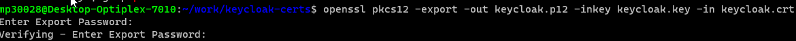
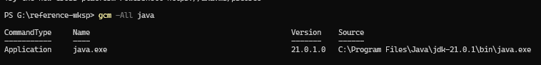
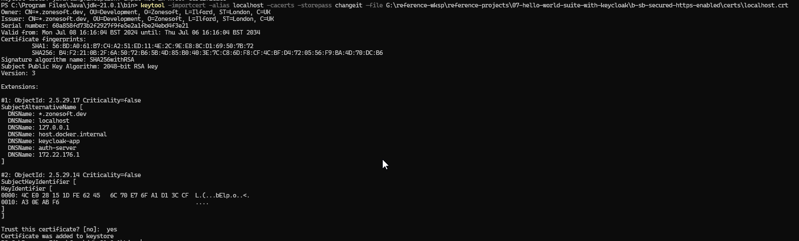

## Overview
These notes describe how to <br/>
  ***i.***   create a self signed certificate<br/>
  ***ii.***  convert the self signed certificates in to ***pkcs12*** format, i.e. the format that java applications can use <br/>
  ***iii.*** setup an application to use ssl <br/>
  ***iv.*** import the CA root certificate so that the JVM can validate and trust the self signed certificate

## 1. Create a self signed certificate	using openssl
On Windows in the wsl-ubuntu distribution run the following command<br/>
<br/>
`openssl req -config localhost-cert.config -newkey rsa -x509 -days 3650 -out localhost.crt`<br/>
<br/>
NB: it requires a config file called localhost-cert.config. A sample copy of this [file can be found here](./localhost-cert.config)<br/>
This will generate two files called `localhost.crt` and `localhost.key`

   
## 2. Convert self signed certificates to pkcs12 format
  - change into the directory where the self signed certs were generated with `openssl` command in ***step 1***
  - run the conversion command `openssl pkcs12 -export -out localhost.p12 -inkey localhost.key -in localhost.crt`<br/>
  You will be prompted for an export password. Make a note of it as it will be needed to set the spring-boot-app `server.ssl.key-store-password` property<br/>
  
  
## 3. Setting up an application to use the generated certificate
Set the following three properties in the `application.properties` file<br/>
***Note:*** adding the `server.ssl.key-store` property will automatically enable ***ssl***. To disable ssl this property must be commented out or removed.<br/>
```
server.ssl.key-store
server.ssl.key-store-password
server.ssl.key-store-type
```
`server.ssl.key-store-type` should be set to *pkcs12* format. Hence the need to convert the self signed certificate to this format

## 4. Import a CA root certificate into the JVM trust store
This step maybe necessary to resolve application start up failures due to *PKIX Validation Error "signature check failed"* exceptions. for example:- <br/>
`... sun.security.validator.ValidatorException: PKIX path validation failed: java.security.cert.CertPathValidatorException: signature check failed`<br/>
This exception crops up when using self signed certificates because of a missing **root CA certificate** in the jvm's keystore.<br/>
To fix the issue it is necessary to import a **CA root certificate** into the JVM trust store<br/>

  ***i.*** Locate the java home. On windows powershell run `gcm -All java` or `Get-Command -All java`


  ***ii.*** Change dir to java home bin e.g. `cd 'C:\Program Files\Java\jdk-21.0.1\bin\'`

  ***iii.*** Check the location of the trust store. By default this is cacert file in `ls ..\lib\security\cacerts` relative to the java home bin directory

  ***iv.*** Delete any existing entries to avoid collisions `keytool -delete -alias localhost -cacerts`

  ***v.*** Import the self signed cert and this will automatically add the CA root cert and the rest of the chain
` keytool -importcert -alias localhost -cacerts -storepass changeit -file path\to\localhost.crt`


