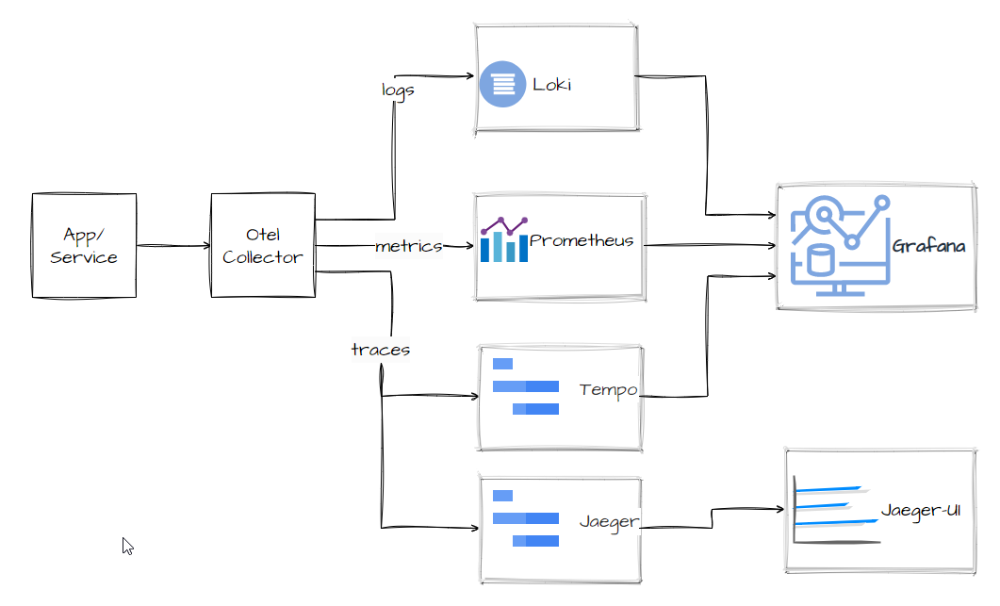

## Overall Architecture



## Observability Setup.
The hello-world-modular project is instrumented for Observability using the OpenTelemetry framework.

[OpenTelemetry](https://opentelemetry.io/docs/what-is-opentelemetry/) is not a backend to store and visualise telemetry data. It instead provides facilities to generate, collect, manage, and export telemetry from systems, no matter their language, infrastructure, or runtime environment for storage and visualization using other tools

## OpenTelemetry framework.
OpenTelemetry provides a lot of ready to use features out of the box with [zero code instrumentation](https://opentelemetry.io/docs/zero-code/java/). The approach here is to use the [Spring Boot starter](https://opentelemetry.io/docs/zero-code/java/spring-boot-starter/) to auto-configure the apps in this project.

The following maven configurations are added to the root pom.xml in order to use the [Spring Boot starter](https://opentelemetry.io/docs/zero-code/java/spring-boot-starter/)
```xml
	<dependencyManagement>
		<dependencies>
			<dependency>
				<groupId>io.opentelemetry</groupId>
				<artifactId>opentelemetry-bom</artifactId>
				<version>${opentelemetry-bom.version}</version>
				<type>pom</type>
				<scope>import</scope>
			</dependency>
			<dependency>
				<groupId>io.opentelemetry.instrumentation</groupId>
				<artifactId>opentelemetry-instrumentation-bom-alpha</artifactId>
				<version>${opentelemetry-instrumentation-bom.version}</version>
				<type>pom</type>
				<scope>import</scope>
			</dependency>
		</dependencies>
	</dependencyManagement>
```
```xml
		<dependency>
			<groupId>io.opentelemetry.instrumentation</groupId>
			<artifactId>opentelemetry-spring-boot-starter</artifactId>
		</dependency>
```

For more details take a [look at this](https://opentelemetry.io/docs/zero-code/java/spring-boot-starter/getting-started/) 

## Application Autoconfiguration

Full details of the configuration options and the defaults that are autoconfigured can be found [here](https://github.com/open-telemetry/opentelemetry-java/blob/main/sdk-extensions/autoconfigure/README.md)

However it is a good idea to configure some of the options explicitly. An example snippet is shown below

```properties
ORGANISATION=zonesoft
NAMESPACE=reference-apps
APPLICATION_NAME=hello-world-ui
DEPLOYMENT=local-dev

OTEL_LOGS_ENABLED=true
OTEL_EXPORTER_ENDPOINT=http://host.docker.internal:4418

spring.application.org=${ENV_ORGANISATION:${ORGANISATION}}
spring.application.namespace=${ENV_NAMESPACE:${NAMESPACE}}
spring.application.name=${ENV_APPLICATION_NAME:${APPLICATION_NAME}}
spring.application.deployment=${ENV_DEPLOYMENT:${DEPLOYMENT}}

otel.service.name=${spring.application.name}
otel.resource.attributes.org=${spring.application.org}
otel.resource.attributes.namespace=${spring.application.namespace}
otel.resource.attributes.deployment=${spring.application.deployment}

otel.propagators=tracecontext,baggage
otel.metrics.exporter=otlp
otel.traces.exporter=otlp
otel.logs.exporter=otlp
otel.exporter.otlp.endpoint=${ENV_OTEL_EXPORTER_ENDPOINT:${OTEL_EXPORTER_ENDPOINT}}
otel.instrumentation.logback-appender.enabled=${ENV_OTEL_LOGS_ENABLED:${OTEL_LOGS_ENABLED}}
```