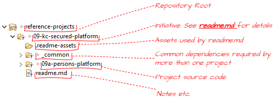
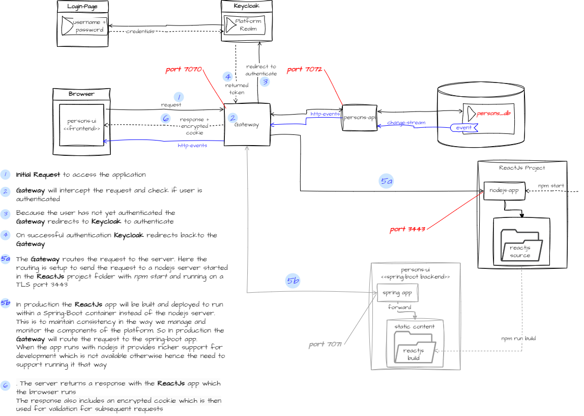

# 09-kc-secured-platform

## Introduction
This initiative is a step by step build out of a reference event driven micro-services architecture.

## Project structure


## Final architecture and authentication flow


## Creating a zip file but excluding some folders

`G:\tools\7-Zip\7z a -tzip target-file.zip source-folder-to-zip\ -mx0 -xr!folder-1-to-exclude -xr!folder-2-to-exclude -xr!file-3-to-exclude -xr!".file-4-starting-with-dot-to-exclude" `  

Example
```
cd G:\wksp-reference\reference-projects\09-kc-secured-platform

G:\tools\7-Zip\7z a -tzip 09b-persons-platform.zip 09a-persons-platform\ -mx0 -xr!node_modules -xr!target -xr!".settings" -xr!".classpath" -xr!".project"
```
