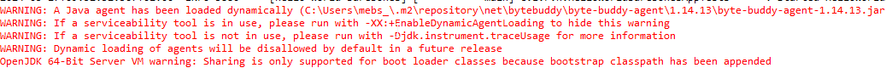
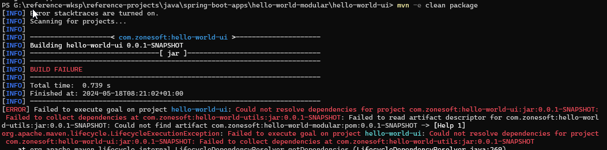
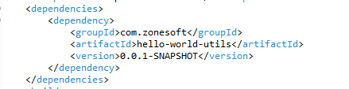

## Useful stuff
#### Get the value of an environment variable on windows
With powershell `echo $env:JAVA_HOME` 
On command-prompt `echo %JAVA_HOME%` 

## Packaging a spring boot app using maven
[See this very important reference](https://docs.spring.io/spring-boot/docs/current/maven-plugin/reference/htmlsingle/) especially [section 5](https://docs.spring.io/spring-boot/docs/current/maven-plugin/reference/htmlsingle#packaging)

## Issues
### 1. Eclipse build warnings - Unsolved
 

Searched based on this log entry but without much success `WARNING: A Java agent has been loaded dynamically (....m2\repository\net\bytebuddy\byte-buddy-agent\1.14.13\byte-buddy-agent-1.14.13.jar)` 
However noticed that if I switch of unit tests then the warning disappears. 
 
---
### 2. Maven build fails, because it does not recognize a .jar added to the build path
 

To fix the issue the jar has to be manually added to the local maven repository with the following command 
`mvn install:install-file -Dfile='.\target\hello-world-utils-0.0.1-SNAPSHOT.jar' -DgroupId='com.zonesoft' -DartifactId='hello-world-utils' -Dversion='0.0.1-SNAPSHOT' -Dpackaging='jar'` 

Then add the file as a maven dependency in the pom 
 
 
---